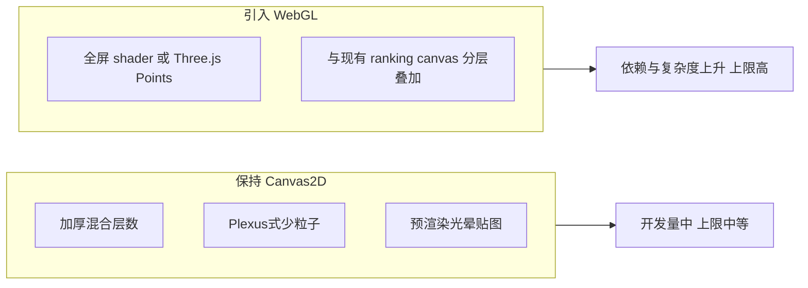

# 炫酷科技感背景：互联网常见优秀模式整理

以下不绑定本项目旧实现，而是从**素材市场 + 大屏动效文章 + 前端技术形态**里抽象出的「高辨识度」背景语言，便于你选型或交给实现阶段逐条落地。

---

## 一、共性：为什么「炫酷」往往看起来更强烈

| 维度 | 常见做法 | 与「朴素」背景的差异 |
|------|----------|----------------------|
| **光感** | 强边缘光、内发光、多层辉光（类似 AE 里 Saber/OF 思路）、**加法/滤色混合** | 仅用低透明度描边时层次薄 |
| **对比** | 深色底 + **少量高饱和点缀**（青、品红、金），局部高光条 | 全屏均匀弱纹理 → 视觉焦点弱 |
| **运动** | **多图层不同速度**（远景慢、近景快）、节奏性脉冲、虚线/粒子沿路径流动 | 单一层正弦变化易显单调 |
| **空间** | **透视网格、粒子景深、体积光柱、弧形飞线** | 平面网格缺少纵深 |
| **装饰密度** | HUD 角框、刻度、细线框面板、点阵地图轮廓（参考 [Design Template Place 类 HUD 描述](https://designtemplateplace.com/product/futuristic-technology-hud-dashboard-background-734251)） | 只有大形几何时信息感不足 |

大屏动效文章（如 [优设：大屏可视化动效](https://www.uisdc.com/large-screen-motion-design)）也把背景动画归为**粒子、波浪/变形、渐变、纹理变形、几何动画**等类型，并强调与**灯光动画**配合；阿里云 DataV 文档则强调**科技感、空间感、光感**三要素（[DataV 设计思路](https://help.aliyun.com/zh/datav/datav-6-0/getting-started/introduction-to-data-dashboard-design)）。

---

## 二、静态背景：优秀方向清单（适合「底图不抢主内容」但仍要酷）

适合作为**循环感弱、层次丰富**的底纹（可轻微呼吸光，但不要大位移）。

1. **FUI/HUD 线框层**  
   - 双层/三层角标、断线边框、细刻度、圆形雷达刻度圈（静态）、半透明面板轮廓。  
   - 参考：矢量 HUD 组件集（如 [Vecteezy HUD 辐射框一类](https://www.vecteezy.com/vector-art/44246386-hud-digital-futuristic-user-interface-radiation-frame-set-sci-fi-high-tech-radioactive-level-element-gui-and-fui-cyber-monitoring-nuclear-indicator-dashboard-panel-head-up-display-ui-design-element)）、[Holographic HUD Kit 风格](https://vill8tion.itch.io/sci-fi-holographic-hud-kit-cyberpunk-ui-4k)（霓虹描边 + Screen 混合思路）。

2. **点阵「地图/星座」底**  
   - 低密度发光点 + 少量连线（知识图谱感），或点阵模拟世界地图轮廓（商业 HUD 模板常见描述见 [Futuristic HUD Dashboard](https://designtemplateplace.com/product/futuristic-technology-hud-dashboard-background-734251)）。

3. **精密几何**  
   - 六边形/三角密铺 + **渐变描边**（每格边缘亮度略有变化）、等距立方体网格（浅 3D 感）。

4. **蓝图/工程图**  
   - 细实线 + 虚线双层、局部圆形孔位、对齐标注线（偏军工/工控大屏）。

5. **深色肌理**  
   - 极低对比噪点、暗色纤维纹理、微弱 vignette（站酷文章强调背景应**压住不跳**）。

6. **对称能量纹样**  
   - 中心弱放射细线、曼陀罗式几何（舞台/LED 素材常见，需控制透明度避免抢条形图）。

---

## 三、动态背景：优秀方向清单（高吸引力、大屏/短视频常见）

素材站标题高频词：**粒子光效、粒子线条、光雨、星空粒子、流体粒子、HUD 动画**（如 [红动粒子线条](https://sucai.redocn.com/13493427.html)、[粒子光雨幕布](https://weili.ooopic.com/weili_26325850.html) 等，体现市场偏好）。

1. **高密度粒子 + 加法混合**  
   - 大量小点、拖尾或光晕，**additive blending**（参考 GPU 粒子文章：[Three.js 粒子 + shader](https://www.suboorkhan.com/blogs/particle-systems-threejs-webgl-shaders.html)）。纯 Canvas 2D 可用较少粒子 + `lighter` 模拟，但要控制数量以保录制帧率。

2. **Plexus 式点线网络**  
   - 粒子间距离小于阈值则连线，线透明度随距离变化；整体缓慢漂移（[闪烁粒子线条类素材](https://sucai.redocn.com/13493427.html) 的典型观感）。

3. **流动「能量带 / 丝带」**  
   - 多层扭曲带、渐变片旋转（类似 **liquid gradient shader** 思路，[Three.js 液态渐变教程](https://madebybeings.com/interactive-liquid-gradient-background-with-three-js-a-step-by-step-tutorial/)）；2D 可用多层旋转线性渐变近似。

4. **六角蜂窝 Shader 风**  
   - 六边形距离场 + 时间扫描高亮（[Hex grid + WebGL 教程](https://inspirnathan.com/posts/176-interactive-hexagon-grid-tutorial-part-7)）；2D 可简化为粗网格 + 扫描带。

5. **地图飞线 / 弧线束**  
   - 多条贝塞尔轨迹 + 头部高亮粒子往返；比静态飞线更有「数据在跑」的感觉（Envato 类 HUD 视频常配动态图表与线条，如 [Cyber Security HUD 动效描述](https://elements.envato.com/blue-shield-with-head-up-display-background-and-fu-X69UYUW)）。

6. **环形扫描 + 扩散波**  
   - 同心圆 + 旋转楔形光 + 周期性 ripple（监控大屏经典）。

7. **竖直/放射「光柱、光雨」**  
   - 粒子或光带沿 Y 轴下落/上升，带镜头感模糊（[粒子光雨幕布](https://weili.ooopic.com/weili_26325850.html) 类）。

8. **音频可视化式频谱条（弱版）**  
   - 底部或两侧细条随时间伪随机起伏，不抢中央排行榜区。

---

## 四、若要在本项目中显著变「炫」：实现路径取舍

- **仅 Canvas 2D**：可通过 **更多图层、`globalCompositeOperation: lighter/screen`、预生成 radial 渐变小图块** 逼近炫酷感，但粒子数与全屏 per-pixel 效果有天花板，且要兼顾 [`MediaRecorder` 30fps 录制](js/dynamic-ranking.js)。  
- **WebGL 全屏底层 + 现有 Canvas 在上**：更易达到素材站级别的粒子密度与流光（参考 [Three.js 粒子实践](https://www.suboorkhan.com/blogs/particle-systems-threejs-webgl-shaders.html)），但需引入构建或 CDN 依赖、处理 `file://` 与模块加载策略。

---

## 五、建议的「优秀背景」短名单（便于你拍板 6+6）

若下一步要在产品里替换主题，可优先从下列组合中选 **动态 6 + 静态 6**：

**动态（高辨识度优先）**  
1. Plexus 点线网（中低密度）  
2. 加法混合粒子星云 + 慢旋转  
3. 多层扭曲流光带（液态渐变 2D 近似）  
4. 飞线束 + 轨迹头尾辉光  
5. 环形扫描 + 扩散波纹  
6. 竖直光柱/粒子雨  

**静态（层次与 HUD 感优先）**  
1. 双层 HUD 角框 + 边沿刻度  
2. 点阵 + 稀疏连线（图谱风）  
3. 六角渐变描边密铺  
4. 蓝图双线路网  
5. 透视静帧地网（无扫描）  
6. 中心弱放射 + 暗角肌理  

---

## 六、文档与版权说明

- 上述 **Envato / 红动 / 我图 / 素材站** 链接仅作**风格参考**；商用需各自授权。  
- 本项目若自研绘制逻辑，不直接嵌入付费素材文件，则无素材版权冲突。

---

确认本参考库后，若你进入**执行阶段**，需要你在「仅 Canvas 2D 加强」与「加 WebGL 底层」之间二选一（或指定优先实现的 2～3 个动态效果），再改 [`js/dynamic-ranking.js`](js/dynamic-ranking.js) / [`js/constants.js`](js/constants.js) 具体落地。
